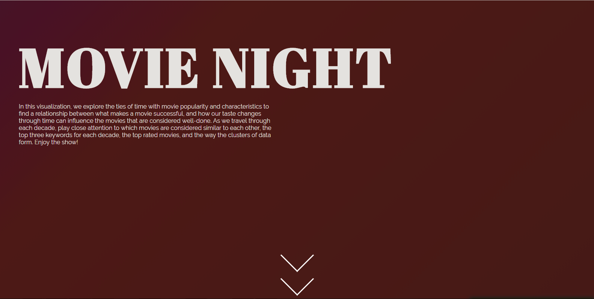
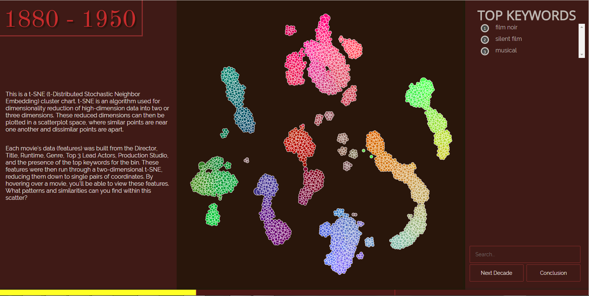
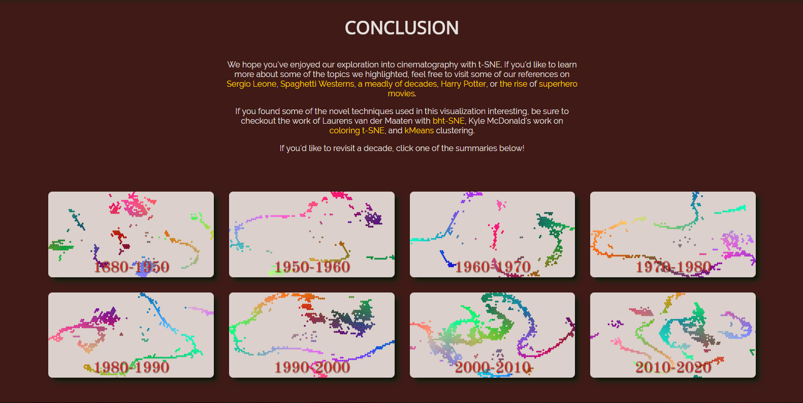

# Introduction

### Created by: Dylan Fontana, Kenedi Heather, Aura Velarde

Welcome to Movie Night.
Through our wesbsite, you will be able to explore cinematography data originating from 1880 and onwards, making for a total of around 28,000 films after data cleaning. Within the site you'll get to explore data by the decade, learning how themes formed within each bin and how they may have changed across decades. Below are some sample screen shots of what you'll find inside!

**Note** the included server is *not* necessary for running the visualization through Github Pages, but is for local development.

# [Github pages](https://dfontana.github.io/DataVisFinal/)
# [Process Book](docs/Process_Book.pdf)
# [Data](https://www.kaggle.com/rounakbanik/the-movies-dataset)
# [Video](https://youtu.be/J7GKU_4xL7w)
# Screenshots

